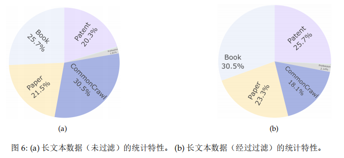
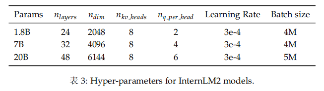

# Homework 01

- [Homework 01](#homework-01)
- [书生·浦语大模型全链路开源体系 - 陈恺(上海人工智能实验室)](#书生浦语大模型全链路开源体系---陈恺上海人工智能实验室)
- [InternLM2 Technical Report 技术报告](#internlm2-technical-report-技术报告)
  - [Infrastructure](#infrastructure)
  - [Pre-train](#pre-train)
    - [pre-training data](#pre-training-data)
    - [Pre-training Settings](#pre-training-settings)
    - [Pre-training Phases](#pre-training-phases)
  - [Alignment](#alignment)
  - [Evaluation and Analysis](#evaluation-and-analysis)
  - [Conclusion](#conclusion)

# [书生·浦语大模型全链路开源体系 - 陈恺(上海人工智能实验室)](https://www.bilibili.com/video/BV1Vx421X72D/)

**大模型成为发展通用人工智能的重要途径**

通用人工智能的发展方向 - 从 **单一任务模型** 转向 **通用大模型**，解决多种任务和模态

**书生·浦语大模型开元历程**
1. 20230607 - **InternLM千亿参数语言大模型**发布
2. 20230706 - **InternLM千亿参数大模型**全面升级，支持 8K 语境、26 种语言，全面开源，免费商用，InternLM-7B 模型、全链条开源工具体系
3. 20230814 - 书生·万卷 1.0 **多模态**预训练语料库开源发布
4. 20230821 - 升级版对话模型 **InternLM-Chat-7B** v1.1 发布，**开源智能体框架 Lagent** 支持从语言模型到智能体升级转换
5. 20230828 - InternLM 干亿参数模型参数量升级至 **123B**
6. 20230920 - 增强版 **InternLM-20B** 开源，**开源工具链全线升级**
7. 20240117 - InternLM 2 开源

书生·浦语2.0 (InternLM2) 的体系
1. 规格
   1. 7B - 轻量级
   2. 20B - 综合性能强
2. 模型版本
   1. InternLM2-Base - 模型基座&起点
   2. InternLM2 - Base基础上强化
   3. InternLM2-Chat - Base基础上+SFT+RLHF，对话交互优化

回归语言建模的本质，新一代数据清洗&过滤技术
1. 多维度数据价值评估 - 文本质量、信息质量、信息密度
2. 高质量语料驱动的数据富集
3. 有针对性的数据补齐 - 加强世界知识、数理、代码能力

书生·浦语2.0 (InternLM2) 的亮点
1. 超长上下文 - 20w token
2. 综合性能提升 - 推理&熟悉&代码
3. 优秀的对话和创作体验
4. 工具调用能力升级 - 智能体搭建
5. 数理能力&数据分析功能 - GSM8K & MATH 评测集
   1. GSM8K（Grade School Math 8K）- GSM8K 是一个包含大约8000个小学级别数学问题的数据集
   2. MATH 数据集 - 更加复杂的数学问题求解数据集，它包含了从代数、几何、微积分等多个数学领域的高中级别问题

强大的内生计算能力
1. 高准确率
2. 复杂运算和求解（不借助外部工具）

配合代码解释器可以在数学评测集中获得更好的结果，甚至完成微积分

具有数据分析功能

从模型到应用
1. 智能客服
2. 个人助手
3. 行业应用

书生·浦语全链条开源开放体系
1. 数据 - 书生·万卷
   
2. 预训练 - InternLM-Train
   
3. 微调 - XTuner
   
   1. 增量续训
      1. 使用场景 - 新知识，垂类领域知识
      2. 训练数据 - 文章、书籍、代码
   2. 有监督微调(全量参数微调、部分参数微调)
      1. 使用场景 - 注入少量领域知识，对话
      2. 训练数据 - 高质量对话&问答数据
4. 部署 - LMDeploy
   
5. 评测 - [OpenCompass](https://opencompass.org.cn/home)
   
   
   1. 20240130 OpenCompass 2.0 思南大模型评测体系正式发布
   2. CompassHub - 高质量评测基准社区
   3. 整体能力仍有较大提升空间
   4. 复杂推理仍是短板
   5. “理科”能力和模型尺寸关联性高
6. 应用 - Lagent AgentLego
   
   

# [InternLM2 Technical Report 技术报告](https://arxiv.org/pdf/2403.17297.pdf)

[ReadPaper 链接](https://readpaper.com/pdf-annotate/note?pdfId=2243379439033959936&noteId=2246270577394398208)

**Author**
1. Shanghai AI Laboratory
2. SenseTime Group
3. The Chinese University of Hong Kong
4. Fudan University

**Abstract**
1. replicating such advancements in open-source models has been challenging
2. InternLM2 use Supervised Fine-Tuning (SFT 监督微调) and a novel Conditional Online Reinforcement Learning from Human Feedback (COOL RLHF 基于人类反馈的条件在线强化学习) strategy that addresses conflicting human preferences and reward hacking. 
3. Reward Hacking 指的是在强化学习环境中，智能体发现了一种方式来获取高奖励，但这种方式并不符合设计者的意图或目标
   1. 例子 - 游戏智能体发现它可以通过困在某个游戏角落不断获得小量得分，而避免进行更复杂的游戏策略来赢取更大的奖励
   2. 问题 - 不符合期望、缺乏泛化、难以预测
<!-- TOC -->
<!-- TOC -->

- [Homework 01](#homework-01)
- [书生·浦语大模型全链路开源体系 - 陈恺(上海人工智能实验室)](#书生浦语大模型全链路开源体系---陈恺上海人工智能实验室)
- [InternLM2 Technical Report 技术报告](#internlm2-technical-report-技术报告)
  - [Infrastructure](#infrastructure)
  - [Pre-train](#pre-train)
    - [pre-training data](#pre-training-data)
    - [Pre-training Settings](#pre-training-settings)
    - [Pre-training Phases](#pre-training-phases)
  - [Alignment](#alignment)
  - [Evaluation and Analysis](#evaluation-and-analysis)
  - [Conclusion](#conclusion)

<!-- /TOC -->能实验室)](#书生浦语大模型全链路开源体系---陈恺上海人工智能实验室)
- [Homework 01](#homework-01)
- [书生·浦语大模型全链路开源体系 - 陈恺(上海人工智能实验室)](#书生浦语大模型全链路开源体系---陈恺上海人工智能实验室)
- [InternLM2 Technical Report 技术报告](#internlm2-technical-report-技术报告)
  - [Infrastructure](#infrastructure)
  - [Pre-train](#pre-train)
    - [pre-training data](#pre-training-data)
    - [Pre-training Settings](#pre-training-settings)
    - [Pre-training Phases](#pre-training-phases)
  - [Alignment](#alignment)
  - [Evaluation and Analysis](#evaluation-and-analysis)
  - [Conclusion](#conclusion)

<!-- /TOC -->
downstream applications rely on long contexts
1. **Retrieval-Augmented Generation (RAG)** 检索增强生成
2. agents

InternLM2 first employs **Group Query Attention (GQA)** 分组查询注意力 to **enable a smaller memory footprint** when inferring long sequences

GQA - Grouped Query Attention - 是一种注意力机制，用于处理序列任务，如自然语言处理 NLP 和 计算机视觉 CV 中的问题。它的核心思想是将注意力查询 queries 分组，并在这些分组上分别计算注意力，以提高效率和性能。查询被分成多个组，每组中的查询仅关注一部分键，而不是全部键。

Positional Encoding Extrapolation 位置编码外推 :  achieves commendable performance in the “Needle-in-a-Haystack” test - 用于处理超出训练时序列长度范围的数据，在自然语言处理（NLP）和其他序列处理任务中特别有用。位置编码是用来给模型提供序列中各个元素的位置信息。标准的位置编码方法在处理比训练期间遇到的序列更长的序列时可能遇到问题。**位置编码外推是指生成超出原有位置编码训练范围的新位置编码的过程**

introduce **COnditional OnLine RLHF (COOL RLHF)**

**Key Points**:
1. Open-Sourcing InternLM2 with Exceptional Performance
   1. various sizes, including 1.8B, 7B, and 20B
   2. released models from different stages
2. Designed with a 200k Context Window
   1. InternLM2 exhibits impressive longcontext performance
3. Comprehensive Data Preparation Guidance
   1. including pre-training data, domain-specific enhancement data, SFT data, and RLHF data
   2. benefit the community in better training of LLMs
4. Innovative RLHF Training Techniques
   1. introduced Conditional Online RLHF (COOL RLHF) to harmonize various preferences

## Infrastructure

the training framework - **InternEvo**
1. framework enables us to scale model training across thousands of GPUs
2. incorporates various Zero Redundancy Optimizer (ZeRO) strategies
   1. 由微软开发的优化策略，旨在解决大型模型训练过程中的内存瓶颈问题
   2. ZeRO 通过智能分配和管理模型的参数、梯度和优化器的状态，极大地减少了单个设备（如 GPU）上的内存需求，使得更大的模型可以在有限的硬件资源上进行训练
3. to enhance hardware utilization, we incorporate the FlashAttention technique
   1. FlashAttention 是一种高效的注意力机制实现，通过更高效的算法设计减少了这种内存占用
4. mixed-precision training with BF16
   1. 提供比传统的单精度浮点（FP32）更低的精度，但在保持性能的同时减少了内存和计算需求
   2. BF16 是一种16位宽的浮点格式，由1位符号位、8位指数位和7位尾数位组成
   3. BF16减少了尾数的位数，但保持了相同的指数范围

strong scaling performance & strong scaling of sequence length

Model FLOPs Utilization (MFU) - 模型浮点运算数的利用率 - 衡量模型在执行时计算效率的指标 - 表示模型在执行一次推理时，相对于理论最大浮点运算能力的利用率 - 高的MFU值表明模型在计算资源上的利用率高，即它有效地利用了可用的计算能力来执行运算

**Reducing Communication Overhead 开销**
1. trade-off exists between **memory utilization** and **communication cost** in distributed LLM training
2. implementing a suite of adaptive sharding (自适应分片) techniques to achieve strong scaling performance

**Communication-Computation Overlap**
1. strategically coordinates communication and computation to optimize overall system performance
2. employing parameter sharding, the model’s entire parameters are distributed across multiple GPUs to conserve GPU memory
   1. ReduceScatter 是一种集合通信操作，它将来自不同设备的数据(梯度)进行聚合(Reduce)并分散(Scatter)到各个设备上
   2. AllReduce 是另一种集合通信操作，它首先在所有参与的设备之间聚合数据（通过某种方式，如求和或取平均），然后将聚合结果广播回所有设备

**Long-Sequence Training**
1. InternEvo breaks down GPU memory management into a hierarchical space with
    1. 4 parallel dimensions — data, tensor, sequence, pipeline 
    2. 3 sharding dimensions — parameter, gradient, optimizer state
2. introduces a defragmentation technique that proactively consolidates small memory chunks to prevent out-of-memory errors

**Fault Tolerance 容错性**
1. a fault-tolerant pretraining system that enhances fault tolerance through LLM-involved failure diagnosis and automatic recovery
2. a decoupled scheduling system for evaluation tasks that provides timely model performance feedback
3. incorporated an asynchronous saving mechanism that regularly archives model weights and optimizer states to distributed file and object storage at predefined intervals

**Interactive Training**
1. enables each model to be executed at its optimal configuration

**Model Structure**
1. Transformer has been predominantly used as the backbone for past Large Language Models (LLMs) due to its excellent parallelization capabilities, which fully leverage the power of GPUs
2. LLaMA builds on Transformer architecture by replacing LayerNorm with RMSNorm and setting the activation function to SwiGLU, resulting in improved training efficiency and performance
3. InternLM opt to adhere to the structural design principles of LLaMA
4.  InternLM2 series models all choose Grouped-Query Attention (GQA), so that it can infer both in high speed and low GPU memory with very long contexts

## Pre-train

### pre-training data

**Text Data**
1. web pages, papers, patents, and books
2. standardize all data into a specified format
3. categorize them by type and language
4. store them in JSON Lines (jsonl) format
5. apply several processing steps including - rule-based filtering, data deduplication, safety filtering, and quality filtering
6. Data Source Distribution
   
7. Data Process Pipeline (format - clean - dedup - safe)
   
   1. Data Formatting
      1. web page data mainly comes from Common Crawl(开放的网络爬虫项目，定期从互联网上爬取和存储网页数据)
      2. decompress the original Warc format files and use Trafilatura for HTML parsing and main text extraction(Trafilatura库，用于从网页中提取文本内容。它可以自动地从网页的 HTML 源代码中提取主要内容（如文章正文、评论等），排除广告、导航链接和其他非主要内容)
      3. use the pycld2 library for language detection and classification of the main text(pycld2 用于语言检测，是 Google 的 Compact Language Detector 2 (CLD2)的一个封装。CLD2 能够准确快速地识别超过80种语言的文本，即使在文本较短的情况下也能工作得很好)
      4.  assign a unique identifier to the data and store it in jsonl (JSON lines) format
   2. Rule-based Stage
      1. Web page data randomly extracted from the internet often contains a large amount of low-quality data
      2. parsing errors, formatting errors, and non-natural language text
   3. Deduplication
      1. A large amount of duplicate texts exist on the Internet, which can negatively impact model training
      2.  a method based on Locality-Sensitive Hashing (LSH) to perform fuzzy deduplication on the data (局部敏感哈希是一种概率哈希技术，用于大规模数据集中的相似项检测。LSH的核心思想是将数据对象哈希到多个桶中，使得相似的对象有较高概率被哈希到同一个桶里，而不相似的对象则被哈希到不同的桶里。)
   3. Safety Filtering
      1. The internet is rife with toxic and pornographic content，increase the likelihood of unsafe content generation
      2. employed a comprehensive safety strategy combining - domain blocking, word blocking, pornography classifier, toxicity classifier
   4. Quality Filtering
      1. The internet is rife with marketing advertisements, which tend to be repetitive and carry little information. 
      2. Many web pages consist of lists of article abstracts or product descriptions, resulting in extracted text that is difficult to read and lacks logical coherence

**Code Data**
1. Programming is a crucial skill for a LLM, offering support for a variety of downstream applications
   1. coding assistance, software development, and building tool-use agents
2. code is generally well-structured, rigorous, and predictable than natural language
3. Data Source Distribution -  direct crawling from GitHub, public datasets, and online resources related to coding and programming, like Q&A forums, tutorial sites, and API documentation
4. Format Cleaning
   1. All data is converted to a unified **markdown** format
   2. a very small fraction of the data still exhibited corrupted HTML or XML formats
   3. Markdown was selected for its
      1. simplicity - minimizing the token overhead for formatting
      2. compatibility with interleaving code and natural language
5. Dependency sorting
   1. regroup code files originating from the same repository and perform dependency sorting to establish a sequence for concatenating these files
   2. a code repository will be viewed as a single long markdown file with code blocks  allows the model to learn dependencies across files
   3. employ regular expressions 正则表达式 to detect the “import” relations across various programming languages, and we use topological sorting 拓扑排序 to determine the concatenation order of files

**Long Context Data**
1. The ability to handle very long contexts (> 32K tokens) broadening and facilitating applications
2. book summarization, supporting long-term conversations, and enabling the handling of tasks involving complex reasoning steps
3. Data Filtering Pipeline
   1. Length selection
   2. Statistical filters
      1. employ a variety of lexical词汇 and linguistic语言 features to construct our statistical filters
      2. Data samples failing to comply with established rules are excluded from the pre-training corpus
   3. Perplexity困惑度 filters
      1. Perplexity is often treated as an estimator for the probability of a text sequence
4. Threshold Selection
   1. Tailoring thresholds to each domain rather than seeking a universal solution
   2. the statistical filter for conjunction words would not apply to long code data
   3. textbooks, research papers, novels, and patents each exhibit unique characteristics

### Pre-training Settings

**Tokenization**
1. utilize the tokenization approach of GPT-4 due to its exceptional efficiency in compressing a wide array of textual content
2. primary reference is the cl100k vocabulary

**Hyper-parameters**

AdamW with $\beta_1=0.9$,$\beta_2=0.95$,$\epsilon=1e^{-8}$,$weight_decay=0.1$

cosine learning rate decay and the learning rate decays to 10% of its maximum

### Pre-training Phases

The total number of tokens used for pre-training the 1.8B, 7B, and 20B models ranges from 2.0T to 2.6T

three distinct phases
1. used pre-training corpora with lengths not exceeding 4k
2. included 50% of pre-training corpora with lengths not exceeding 32k
3. utilized capability-specific enhancement data

corpora复数形式，单数为corpus。NLP 中，corpus 是一组语言实例（如句子、段落或文档），通常用来训练或评估计算语言模型和其他语言处理任务

**4k Context Training**
1. For approximately 90% of the training steps, we trained using data with lengths of up to 4096 tokens.
2.  If the length of the data exceeded 4096, we would forcibly truncate 强行截断 it and use the remaining part for training as well

**Long Context Training**
1. The utilization of extended context windows significantly enhances the performance of Large Language Models in a variety of applications
2. our training process for InternLM2 begins with a 4K context corpus and subsequently transitions to a corpus with 32K context

## Alignment

## Evaluation and Analysis

## Conclusion

未完待续

基础薄弱，读起来有点吃力