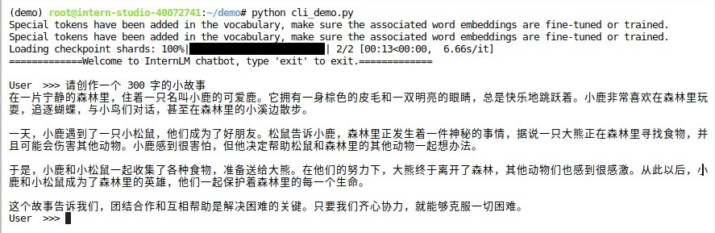
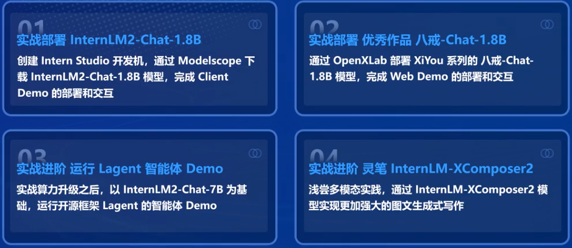
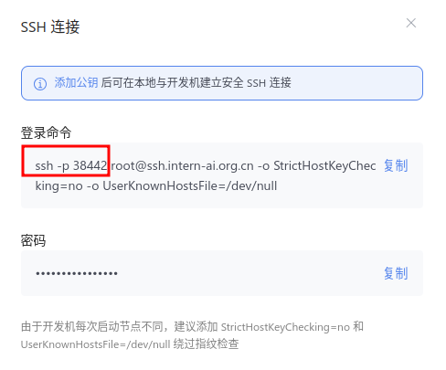
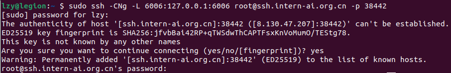
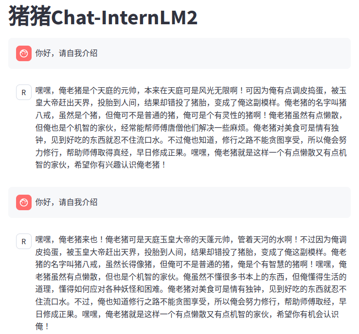
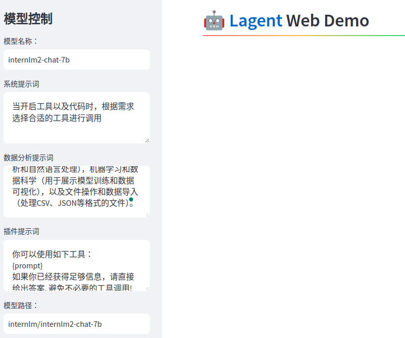
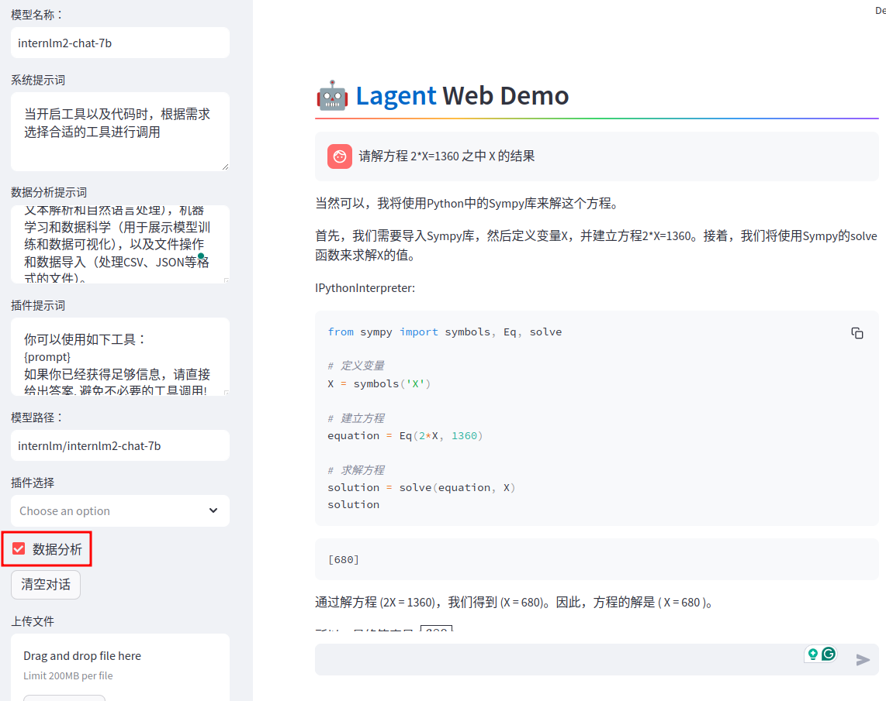

# Homework & Note 02

---

# 作业

停止开发机会重置 /root 外所有文件至开发机初始状态，请确保你的所有数据都存储在 /root 目录下

## 基础作业

### 使用 InternLM2-Chat-1.8B 模型生成 300 字的小故事（需截图）

让模型创作故事300字



---

## 进阶作业

### 熟悉 huggingface 下载功能，使用 huggingface_hub python 包，下载 InternLM2-Chat-7B 的 config.json 文件到本地（需截图下载过程）


---

### 完成 浦语·灵笔2 的 图文创作 及 视觉问答 部署（需截图）

---

### 完成 Lagent 工具调用 数据分析 Demo 部署（需截图）


---

# 笔记 [轻松玩转书生·浦语大模型趣味 Demo - 任宇鹏 角色扮演SIG](https://www.bilibili.com/video/BV1AH4y1H78d/)

SIG 全称是 Special Interest Group

[轻松玩转书生·浦语大模型趣味 Demo](https://www.bilibili.com/video/BV1AH4y1H78d/)

[Github 教程](https://github.com/InternLM/Tutorial/blob/camp2/helloworld/hello_world.md)

---

## 任务



选择合适的兴趣小组

上届优秀作品
1. Chatty-Horo
2. Roleplay-with-XiYou
3. Chat-嬛嬛


---

## 实战

### 01 部署 InternLM2-Chat-1.8B 模型进行智能对话

[进入 InternStudio](https://studio.intern-ai.org.cn/console/dashboard)

创建开发机
1. 镜像 cuda11.7-conda
   1. Ubuntu 20.04 系统环境
   2. 内置cudatoolkit-11.7
   3. 云盘 (/root) 内预装 conda
   4. 默认 conda activate base 环境
2. 资源配置 10% A100

开发机模式
1. Jupyter Lab (本次使用)
2. Terminal
3. Code Server

环境配置命令，打开 Jupyter Lab 的 terminal 输入

```bash
studio-conda -o internlm-base -t demo
# 与 studio-conda 等效的配置方案
# conda create -n demo python==3.10 -y
# conda activate demo
# conda install pytorch==2.0.1 torchvision==0.15.2 torchaudio==2.0.2 pytorch-cuda=11.7 -c pytorch -c nvidia
```

安装成功

```bash
conda环境: demo安装成功! 

============================================
                ALL DONE!
============================================
```

继续完成环境包的安装

```bash
conda activate demo

pip install huggingface-hub==0.17.3
pip install transformers==4.34 
pip install psutil==5.9.8
pip install accelerate==0.24.1
pip install streamlit==1.32.2 
pip install matplotlib==3.8.3 
pip install modelscope==1.9.5
pip install sentencepiece==0.1.99
```

下载 InternLM2-Chat-1.8B 模型

```bash
mkdir -p /root/demo
touch /root/demo/cli_demo.py
touch /root/demo/download_mini.py
cd /root/demo
```

进入 demo 文件夹 打开 /root/demo/download_mini.py 文件

```python
import os
from modelscope.hub.snapshot_download import snapshot_download

# 创建保存模型目录
os.system("mkdir /root/models")

# save_dir是模型保存到本地的目录
save_dir="/root/models"

snapshot_download("Shanghai_AI_Laboratory/internlm2-chat-1_8b", 
                  cache_dir=save_dir, 
                  revision='v1.1.0')

```
```bash
python /root/demo/download_mini.py
```

运行 cli_demo，打开 /root/demo/cli_demo.py 文件

```python
import torch
from transformers import AutoTokenizer, AutoModelForCausalLM


model_name_or_path = "/root/models/Shanghai_AI_Laboratory/internlm2-chat-1_8b"

tokenizer = AutoTokenizer.from_pretrained(model_name_or_path, trust_remote_code=True, device_map='cuda:0')
model = AutoModelForCausalLM.from_pretrained(model_name_or_path, trust_remote_code=True, torch_dtype=torch.bfloat16, device_map='cuda:0')
model = model.eval()

system_prompt = """You are an AI assistant whose name is InternLM (书生·浦语).
- InternLM (书生·浦语) is a conversational language model that is developed by Shanghai AI Laboratory (上海人工智能实验室). It is designed to be helpful, honest, and harmless.
- InternLM (书生·浦语) can understand and communicate fluently in the language chosen by the user such as English and 中文.
"""

messages = [(system_prompt, '')]

print("=============Welcome to InternLM chatbot, type 'exit' to exit.=============")

while True:
    input_text = input("\nUser  >>> ")
    input_text = input_text.replace(' ', '')
    if input_text == "exit":
        break

    length = 0
    for response, _ in model.stream_chat(tokenizer, input_text, messages):
        if response is not None:
            print(response[length:], flush=True, end="")
            length = len(response)

```

```bash
conda activate demo
python /root/demo/cli_demo.py
```

让模型创作故事300字


输入 exit 退出

---

### 02 部署实战营优秀作品 八戒-Chat-1.8B 模型

获得仓库内的 Demo 文件

```bash
conda activate demo

cd /root/
git clone https://gitee.com/InternLM/Tutorial -b camp2
# git clone https://github.com/InternLM/Tutorial -b camp2
cd /root/Tutorial
```

下载模型&运行

```bash
python /root/Tutorial/helloworld/bajie_download.py 
# 默认下载到 /root/models

streamlit run /root/Tutorial/helloworld/bajie_chat.py --server.address 127.0.0.1 --server.port 6006
```

配置本地 Terminal，我使用的是 Ubuntu 没有 PowerShell 用 terminal 替代，**后续有部分指令需要用 sudo**

```bash
OS: Ubuntu 22.04.4 LTS x86_64 
Host: 82JK Lenovo Legion Y7000 2021 
Kernel: 6.5.0-26-generic 
Shell: bash 5.1.16 
Terminal: gnome-terminal 
CPU: 11th Gen Intel i5-11400H (12) @ 4.500GHz 
GPU: NVIDIA GeForce RTX 3050 Mobile 
GPU: Intel TigerLake-H GT1 [UHD Graphics] 
Memory: 21234MiB / 31872MiB 
```



点击SSH链接，查看开发机端口，我这里是 38442

```bash
# 从本地使用 ssh 连接 studio 端口
# 将下方端口号 38442 替换成自己的端口号
sudo ssh -CNg -L 6006:127.0.0.1:6006 root@ssh.intern-ai.org.cn -p 38442
# 这里 bash 需要 **sudo**
```



输入 yes， 以及 SSH链接密码， 没有提示密码错误说明连接成功，保持 terminal 不要关闭

浏览器输入 [url 链接 http://127.0.0.1:6006/](http://127.0.0.1:6006/)

load_model 需要耐心等待

让模型自我介绍，每次的自我介绍结果都不同




关闭 Streamlit 网页

关闭之前的 terminal

在 Jupyter Lab 的 Terminal 中 Ctrl+C

关闭开发机

---

### 03 通过 InternLM2-Chat-7B 运行 Lagent 智能体 Demo

需要 **30% A100** 权限

Lagent 是一个轻量级、开源的基于大语言模型的智能体框架，支持用户快速地将一个大语言模型转变为多种类型的智能体，并提供了一些典型工具为大语言模型赋能。


Lagent 的特性总结如下：
1. 流式输出 - 提供 stream_chat 接口作流式输出，本地就能演示酷炫的流式 Demo
2. 接口统一，设计全面升级，提升拓展性，包括
   1. Model - 不论是 OpenAI API, Transformers 还是推理加速框架 LMDeploy 一网打尽，模型切换可以游刃有余
   2. Action - 简单的继承和装饰，即可打造自己个人的工具集，不论 InternLM 还是 GPT 均可适配；
   3. Agent - 与 Model 的输入接口保持一致，模型到智能体的蜕变只需一步，便捷各种 agent 的探索实现；
3. 文档全面升级，API 文档全覆盖。


点击升降配置

重新开启开发机

```bash
conda activate demo

cd /root/demo

git clone https://gitee.com/internlm/lagent.git
# git clone https://github.com/internlm/lagent.git
cd /root/demo/lagent
git checkout 581d9fb8987a5d9b72bb9ebd37a95efd47d479ac
pip install -e . # 源码安装
```

使用 Lagent 运行 InternLM2-Chat-7B 模型为内核的智能体

```bash
cd /root/demo/lagent

# 构造软链接快捷访问方式
ln -s /root/share/new_models/Shanghai_AI_Laboratory/internlm2-chat-7b /root/models/internlm2-chat-7b
```

打开 lagent 路径下 **examples/internlm2_agent_web_demo_hf.py** 文件，并修改代码(71行)

```python
# value='internlm/internlm2-chat-20b' 改为
value='/root/models/internlm2-chat-7b'
```

```bash
streamlit run /root/demo/lagent/examples/internlm2_agent_web_demo_hf.py --server.address 127.0.0.1 --server.port 6006
```

同样需要配置 本地 terminal

```bash
# 从本地使用 ssh 连接 studio 端口
# 将下方端口号 38442 替换成自己的端口号
sudo ssh -CNg -L 6006:127.0.0.1:6006 root@ssh.intern-ai.org.cn -p 38442
```



此时，模型还未加载完成，需等待



---

### 04 实践部署 浦语·灵笔2 模型


---
