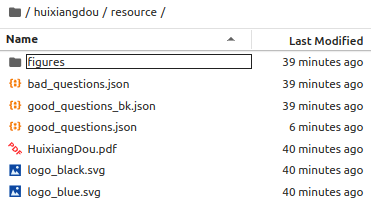
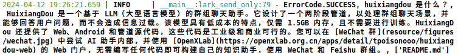
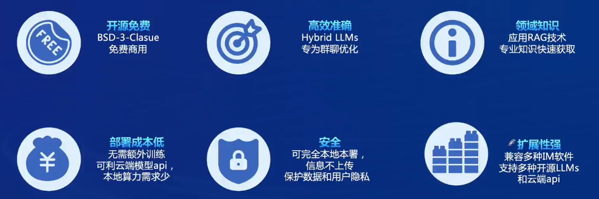

# Homework & Note 03

前面是作业，后面是笔记

---

## 目录

- [Homework \& Note 03](#homework--note-03)
  - [目录](#目录)
  - [作业](#作业)
    - [基础作业](#基础作业)
      - [茴香豆 Web 版中创建自己领域的知识问答助手](#茴香豆-web-版中创建自己领域的知识问答助手)
      - [InternLM Studio 上部署茴香豆技术助手](#internlm-studio-上部署茴香豆技术助手)
      - [补充阅读](#补充阅读)
    - [进阶作业 - 二选一](#进阶作业---二选一)
      - [将 茴香豆 部署到飞书平台](#将-茴香豆-部署到飞书平台)
    - [大作业项目选题](#大作业项目选题)
      - [选题](#选题)
  - [笔记 茴香豆：搭建你的 RAG 智能助理 - 北辰 社区贡献者](#笔记-茴香豆搭建你的-rag-智能助理---北辰-社区贡献者)
    - [00 Link](#00-link)
    - [01 RAG 基础介绍](#01-rag-基础介绍)
    - [02 HuiXiangDou 茴香豆 介绍](#02-huixiangdou-茴香豆-介绍)
    - [03 实际演示 使用茴香豆搭建RAG知识库实战](#03-实际演示-使用茴香豆搭建rag知识库实战)
      - [实践一 : 茴香豆 Web 版演示](#实践一--茴香豆-web-版演示)
      - [InternStudio 部署 茴香豆](#internstudio-部署-茴香豆)


---

## 作业

### 基础作业

基础作业
1. 在 茴香豆 Web 版中创建自己领域的知识问答助手
   1. 参考视频 - 零编程玩转大模型，学习茴香豆部署群聊助手
   2. 完成不少于 400 字的笔记 + 线上茴香豆助手对话截图(不少于5轮)
   3. （可选）参考 代码 在自己的服务器部署茴香豆 Web 版
2. 在 InternLM Studio 上部署茴香豆技术助手
   1. 根据教程文档搭建 茴香豆技术助手，针对问题"茴香豆怎么部署到微信群？"进行提问
   2. 完成不少于 400 字的笔记 + 截图

[茴香豆 Github链接](https://github.com/InternLM/HuixiangDou)

---

#### 茴香豆 Web 版中创建自己领域的知识问答助手

[LLM问答助手茴香豆发布web版，零开发集成微信&飞书群 - B站视频](https://www.bilibili.com/video/BV17A4m1N7CG/)


**茴香豆** 是一个基于 LLM 的领域知识助手，应对群聊场景(微信&飞书)，解答用户问题的同时，不会消息泛滥

**创建知识库**
1. name : GovChatBot
2. password : G\*\*\*\*\*\*B\*\*

**添加文档** - 支持 pdf/word/markdown/excel/ppt/html/txt 格式
1. 数字时代治理现代化研究报告（2023年）——大模型在政务领域应用的实践及前景.pdf
2. 政务大模型建设路径及评价体系研究报告.pdf


**带着知识库聊天**


当判断是闲聊时，会有提示 - 判断出不是个问题时，在群里不回答

可以对模型的回复进行 正/负反馈

回答也会给出相应的参考文档


正常回答没有问题


不知道这个回答是不是有问题，是不是这些文章里面提到了 ChatGPT 所以就算上参考了？


类似的问题


测试颜文字，检查出了非问题


英语回答较为通顺


没有记住我的指令

测试 添加正例，想把 “你好” 改成 应该答复的，但是没有成功


测试 添加反例，避免模型在群聊中回答政治问题，规避风险


自己没有买服务器，所以暂时没有办法部署，后续再尝试

[Serper](https://serper.dev/) 好像不能注册了，暂时无法测试 **网络搜索开关**


#### InternLM Studio 上部署茴香豆技术助手

使用 **Cuda11.7-conda 镜像**，**30% A100 * 1** 的选项

**配置基础环境**

```bash
# 从官方环境复制运行 InternLM 的基础环境，命名为 InternLM2_Huixiangdou
studio-conda -o internlm-base -t InternLM2_Huixiangdou
# 时间较长，耐心等待

# Installed kernelspec InternLM2_Huixiangdou in /root/.local/share/jupyter/kernels/internlm2_huixiangdou
#  conda环境: InternLM2_Huixiangdou安装成功! 

#     ============================================
#                     ALL DONE!
#     ============================================


# 检查 conda 环境
conda env list

# # conda environments:
# #
# base                  *  /root/.conda
# InternLM2_Huixiangdou     /root/.conda/envs/InternLM2_Huixiangdou
# demo                     /root/.conda/envs/demo

# 激活 InternLM2_Huixiangdou python 虚拟环境
conda activate InternLM2_Huixiangdou
```

**下载基础文件**

避免 HuggingFace 登录问题，所有作业和教程涉及的模型都已经存放在 Intern Studio 开发机共享文件中

本教程选用 **InternLM2-Chat-7B** 作为基础模型

```bash
# 创建模型文件夹
cd /root && mkdir models

# 复制BCE模型
ln -s /root/share/new_models/maidalun1020/bce-embedding-base_v1 /root/models/bce-embedding-base_v1
ln -s /root/share/new_models/maidalun1020/bce-reranker-base_v1 /root/models/bce-reranker-base_v1

# 复制大模型参数（下面的模型，根据作业进度和任务进行**选择一个**就行）
ln -s /root/share/new_models/Shanghai_AI_Laboratory/internlm2-chat-7b /root/models/internlm2-chat-7b
```

链接的模型如下图所示，共三个

```bash
ll /root/models/
```


**下载安装茴香豆**

安装茴香豆运行所需依赖

```bash
# 安装 python 依赖
# pip install -r requirements.txt

pip install protobuf==4.25.3 accelerate==0.28.0 aiohttp==3.9.3 auto-gptq==0.7.1 bcembedding==0.1.3 beautifulsoup4==4.8.2 einops==0.7.0 faiss-gpu==1.7.2 langchain==0.1.14 loguru==0.7.2 lxml_html_clean==0.1.0 openai==1.16.1 openpyxl==3.1.2 pandas==2.2.1 pydantic==2.6.4 pymupdf==1.24.1 python-docx==1.1.0 pytoml==0.1.21 readability-lxml==0.8.1 redis==5.0.3 requests==2.31.0 scikit-learn==1.4.1.post1 sentence_transformers==2.2.2 textract==1.6.5 tiktoken==0.6.0 transformers==4.39.3 transformers_stream_generator==0.0.5 unstructured==0.11.2

## 因为 Intern Studio 不支持对系统文件的永久修改，在 Intern Studio 安装部署的同学不建议安装 Word 依赖，后续的操作和作业不会涉及 Word 解析。
## 想要自己尝试解析 Word 文件的同学，uncomment 掉下面这行，安装解析 .doc .docx 必需的依赖
apt update && apt -y install python-dev python libxml2-dev libxslt1-dev antiword unrtf poppler-utils pstotext tesseract-ocr flac ffmpeg lame libmad0 libsox-fmt-mp3 sox libjpeg-dev swig libpulse-dev
```

从茴香豆官方仓库下载茴香豆

```bash
cd /root
# 下载 repo
git clone https://github.com/internlm/huixiangdou && cd huixiangdou
git checkout 447c6f7e68a1657fce1c4f7c740ea1700bde0440
# You are in 'detached HEAD' state. You can look around, make experimental
# changes and commit them, and you can discard any commits you make in this
# state without impacting any branches by switching back to a branch.
# HEAD is now at 447c6f7 Merge pull request #208 from InternLM/tpoisonooo-patch-2
```


解决 faiss 安装失败

```bash
conda activate InternLM2_Huixiangdou
conda install -c pytorch faiss-gpu
```

**使用茴香豆搭建 RAG 助手**

茴香豆的配置文件位于代码主目录下，采用 **Toml** 形式，有着丰富的功能

修改配置文件

```bash
# 命令行输入下面的命令，修改用于向量数据库和词嵌入的模型
sed -i '6s#.*#embedding_model_path = "/root/models/bce-embedding-base_v1"#' /root/huixiangdou/config.ini

# 用于检索的重排序模型
sed -i '7s#.*#reranker_model_path = "/root/models/bce-reranker-base_v1"#' /root/huixiangdou/config.ini

# 和本次选用的大模型
sed -i '29s#.*#local_llm_path = "/root/models/internlm2-chat-7b"#' /root/huixiangdou/config.ini
```

更改后的 config.ini

```text
[feature_store]
# `feature_store.py` use this throttle to distinct `good_questions` and `bad_questions`
reject_throttle = 0.22742061846268935
# text2vec model path, support local relative path and huggingface model format.
# also support local path, model_path = "/path/to/your/text2vec-model"
embedding_model_path = "/root/models/bce-embedding-base_v1"
reranker_model_path = "/root/models/bce-reranker-base_v1"
work_dir = "workdir"

[web_search]
# check https://serper.dev/api-key to get a free API key
x_api_key = "${YOUR-API-KEY}"
domain_partial_order = ["openai.com", "pytorch.org", "readthedocs.io", "nvidia.com", "stackoverflow.com", "juejin.cn", "zhuanlan.zhihu.com", "www.cnblogs.com"]
save_dir = "logs/web_search_result"

[llm]
enable_local = 1
enable_remote = 0
# hybrid llm service address
client_url = "http://127.0.0.1:8888/inference"

[llm.server]
# local LLM configuration
# support "internlm/internlm2-chat-7b" and "qwen/qwen-7b-chat-int8"
# support local path, for example
# local_llm_path = "/path/to/your/internlm2"
# also support local_llm_path = "internlm/internlm2-chat-20b"

local_llm_path = "/root/models/internlm2-chat-7b"
local_llm_max_text_length = 3000
local_llm_bind_port = 8888

# remote LLM service configuration
# support "gpt", "kimi", "deepseek", "zhipuai", "xi-api" and "alles-apin"
# xi-api and alles-apin is chinese gpt proxy

remote_type = "kimi"
remote_api_key = "${YOUR-API-KEY}"
# max text length for remote LLM.
# use 128000 for kimi, 192000 for gpt/xi-api, 16000 for deepseek, 128000 for zhipuai
remote_llm_max_text_length = 128000
# openai API model type, support model list:
# "moonshot-v1-128k" for kimi,
# "gpt-4-0613" for gpt/xi-api,
# "deepseek-chat" for deepseek,
# "glm-4" for zhipuai,
remote_llm_model = "moonshot-v1-128k"
# request per minute
rpm = 500

[worker]
# enable search enhancement or not
enable_sg_search = 0
save_path = "logs/work.txt"

[worker.time]
start = "00:00:00"
end = "23:59:59"
has_weekday = 1

[sg_search]
# download `src` from https://github.com/sourcegraph/src-cli#installation
binary_src_path = "/usr/local/bin/src"
src_access_token = "${YOUR-SRC-ACCESS-TOKEN}"

# add your repo here, we just take opencompass and lmdeploy as example
[sg_search.opencompass]
github_repo_id = "open-compass/opencompass"
introduction = "用于评测大型语言模型（LLM）. 它提供了完整的开源可复现的评测框架，支持大语言模型、多模态模型的一站式评测，基于分布式技术，对大参数量模型亦能实现高效评测。评测方向汇总为知识、语言、理解、推理、考试五大能力维度，整合集纳了超过70个评测数据集，合计提供了超过40万个模型评测问题，并提供长文本、安全、代码3类大模型特色技术能力评测。"
# introduction = "For evaluating Large Language Models (LLMs). It provides a fully open-source, reproducible evaluation framework, supporting one-stop evaluation for large language models and multimodal models. Based on distributed technology, it can efficiently evaluate models with a large number of parameters. The evaluation directions are summarized in five capability dimensions: knowledge, language, understanding, reasoning, and examination. It integrates and collects more than 70 evaluation datasets, providing in total over 400,000 model evaluation questions. Additionally, it offers evaluations for three types of capabilities specific to large models: long text, security, and coding."

[sg_search.lmdeploy]
github_repo_id = "internlm/lmdeploy"
introduction = "lmdeploy 是一个用于压缩、部署和服务 LLM（Large Language Model）的工具包。是一个服务端场景下，transformer 结构 LLM 部署工具，支持 GPU 服务端部署，速度有保障，支持 Tensor Parallel，多并发优化，功能全面，包括模型转换、缓存历史会话的 cache feature 等. 它还提供了 WebUI、命令行和 gRPC 客户端接入。"
# introduction = "lmdeploy is a toolkit for compressing, deploying, and servicing Large Language Models (LLMs). It is a deployment tool for transformer-structured LLMs in server-side scenarios, supporting GPU server-side deployment, ensuring speed, and supporting Tensor Parallel along with optimizations for multiple concurrent processes. It offers comprehensive features including model conversion, cache features for caching historical sessions and more. Additionally, it provides access via WebUI, command line, and gRPC clients."

[frontend]
# chat group assistant type, support "lark", "lark_group", "wechat_personal" and "none"
# for "lark", open https://open.feishu.cn/document/client-docs/bot-v3/add-custom-bot to add bot, **only send, cannot receive**
# for "lark_group", open https://open.feishu.cn/document/home/introduction-to-custom-app-development/self-built-application-development-process to create one
# for "wechat_personal", read ./docs/add_wechat_group_zh.md to setup gateway
type = "none"

# for "lark", it is chat group webhook url, send reply to group, for example "https://open.feishu.cn/open-apis/bot/v2/hook/xxxxxxxxxxxxxxx"
# for "lark_group", it is the url to fetch chat group message, for example "http://101.133.161.20:6666/fetch", `101.133.161.20` is your own public IPv4 addr
# for "wechat_personal", it is useless
webhook_url = "https://open.feishu.cn/open-apis/bot/v2/hook/xxxxxxxxxxxxxxx"

# when a new group chat message is received, should it be processed immediately or wait for 18 seconds in case the user hasn't finished speaking?
# support "immediate"
message_process_policy = "immediate"

[frontend.lark_group]
# "lark_group" configuration examples, use your own app_id and secret !!!
app_id = "cli_a53a34dcb778500e"
app_secret = "2ajhg1ixSvlNm1bJkH4tJhPfTCsGGHT1"
encrypt_key = "abc"
verification_token = "def"

[frontend.wechat_personal]
# "wechat_personal" listen port
bind_port = 9527

```

**创建知识库**

使用 InternLM 的 Huixiangdou 文档作为新增知识数据检索来源，在不重新训练的情况下，打造一个 Huixiangdou 技术问答助手

```bash
# 下载 Huixiangdou 语料
cd /root/huixiangdou && mkdir repodir
git clone https://github.com/internlm/huixiangdou --depth=1 repodir/huixiangdou
```


提取知识库特征，创建向量数据库。数据库向量化的过程应用到了 **LangChain** 的相关模块，默认嵌入和重排序模型调用的 **网易 BCE 双语模型**，如果没有在 config.ini 文件中指定本地模型路径，茴香豆将自动从 HuggingFace 拉取默认模型。

除了语料知识的向量数据库，茴香豆建立**接受和拒答**两个**向量数据库**，用来在检索的过程中更加精确的判断提问的相关性
1. **接受问题列表** - huixiangdou/resource/good_questions.json
2. **拒绝问题列表** - huixiangdou/resource/bad_questions.json



```bash
cd /root/huixiangdou
mv resource/good_questions.json resource/good_questions_bk.json

echo '[
    "mmpose中怎么调用mmyolo接口",
    "mmpose实现姿态估计后怎么实现行为识别",
    "mmpose执行提取关键点命令不是分为两步吗，一步是目标检测，另一步是关键点提取，我现在目标检测这部分的代码是demo/topdown_demo_with_mmdet.py demo/mmdetection_cfg/faster_rcnn_r50_fpn_coco.py checkpoints/faster_rcnn_r50_fpn_1x_coco_20200130-047c8118.pth   现在我想把这个mmdet的checkpoints换位yolo的，那么应该怎么操作",
    "在mmdetection中，如何同时加载两个数据集，两个dataloader",
    "如何将mmdetection2.28.2的retinanet配置文件改为单尺度的呢？",
    "1.MMPose_Tutorial.ipynb、inferencer_demo.py、image_demo.py、bottomup_demo.py、body3d_pose_lifter_demo.py这几个文件和topdown_demo_with_mmdet.py的区别是什么，\n2.我如果要使用mmdet是不是就只能使用topdown_demo_with_mmdet.py文件，",
    "mmpose 测试 map 一直是 0 怎么办？",
    "如何使用mmpose检测人体关键点？",
    "我使用的数据集是labelme标注的，我想知道mmpose的数据集都是什么样式的，全都是单目标的数据集标注，还是里边也有多目标然后进行标注",
    "如何生成openmmpose的c++推理脚本",
    "mmpose",
    "mmpose的目标检测阶段调用的模型，一定要是demo文件夹下的文件吗，有没有其他路径下的文件",
    "mmpose可以实现行为识别吗，如果要实现的话应该怎么做",
    "我在mmyolo的v0.6.0 (15/8/2023)更新日志里看到了他新增了支持基于 MMPose 的 YOLOX-Pose，我现在是不是只需要在mmpose/project/yolox-Pose内做出一些设置就可以，换掉demo/mmdetection_cfg/faster_rcnn_r50_fpn_coco.py 改用mmyolo来进行目标检测了",
    "mac m1从源码安装的mmpose是x86_64的",
    "想请教一下mmpose有没有提供可以读取外接摄像头，做3d姿态并达到实时的项目呀？",
    "huixiangdou 是什么？",
    "使用科研仪器需要注意什么？",
    "huixiangdou 是什么？",
    "茴香豆 是什么？",
    "茴香豆 能部署到微信吗？",
    "茴香豆 怎么应用到飞书",
    "茴香豆 能部署到微信群吗？",
    "茴香豆 怎么应用到飞书群",
    "huixiangdou 能部署到微信吗？",
    "huixiangdou 怎么应用到飞书",
    "huixiangdou 能部署到微信群吗？",
    "huixiangdou 怎么应用到飞书群",
    "huixiangdou",
    "茴香豆",
    "茴香豆 有哪些应用场景",
    "huixiangdou 有什么用",
    "huixiangdou 的优势有哪些？",
    "茴香豆 已经应用的场景",
    "huixiangdou 已经应用的场景",
    "huixiangdou 怎么安装",
    "茴香豆 怎么安装",
    "茴香豆 最新版本是什么",
    "茴香豆 支持哪些大模型",
    "茴香豆 支持哪些通讯软件",
    "config.ini 文件怎么配置",
    "remote_llm_model 可以填哪些模型?"
]' > /root/huixiangdou/resource/good_questions.json

```

创建一个测试用的问询列表，用来测试拒答流程是否起效

```bash
cd /root/huixiangdou

echo '[
"huixiangdou 是什么？",
"你好，介绍下自己"
]' > ./test_queries.json
```

创建 RAG 检索过程中使用的向量数据库

```bash
# 创建向量数据库存储目录
cd /root/huixiangdou && mkdir workdir 

# 分别向量化知识语料、接受问题和拒绝问题中后保存到 workdir
python3 -m huixiangdou.service.feature_store --sample ./test_queries.json

# 向量数据库的创建需要等待一小段时间，过程约占用 1.6G 显存

# 累计48文件，成功22个，跳过0个，异常26个
```

问题1结果 - huixiangdou 是什么？ - process


问题2结果 - 你好，介绍下自己 - reject


Huixiangdou **相关的新增知识就以向量数据库的形式存储在 workdir 文件夹**下


检索过程中，茴香豆会将**输入问题与两个列表中的问题在向量空间进行相似性比较**，判断该问题是否应该回答，避免群聊过程中的问答泛滥

确定的回答的问题会利用基础模型提取关键词，在知识库中**检索 top K 相似的 chunk**，**综合问题和检索到的 chunk 生成答案**


**运行茴香豆知识助手**

已经提取了知识库特征，并创建了对应的向量数据库，测试效果

```bash
# 填入问题
sed -i '74s/.*/    queries = ["huixiangdou 是什么？", "茴香豆怎么部署到微信群", "今天天气怎么样？"]/' /root/huixiangdou/huixiangdou/main.py

# 运行茴香豆
cd /root/huixiangdou/
python3 -m huixiangdou.main --standalone
```
RAG 技术的优势就是**非参数化的模型调优**，仍然是基础模型 InternLM2-Chat-7B， **没有任何额外数据的训练**。面对同样的问题，我们的茴香豆技术助理能够根据我们提供的数据库生成准确的答案

问题1结果 - huixiangdou 是什么？ - **success**



给出的链接也正确

https://openxlab.org.cn/apps/detail/tpoisonooo/huixiangdou-web

问题2结果 - 茴香豆怎么部署到微信群 - **success**


问题3结果 - 今天天气怎么样？ - **unrelated**


其他尝试问题

```bash
sed -i '74s/.*/    queries = ["茴香豆怎么部署到微信群", "茴香豆部署到微信群之后可以做什么", "how to deploy Huixiangdou to wechat groups?"]/' /root/huixiangdou/huixiangdou/main.py
```


问题1结果 - 茴香豆怎么部署到微信群 - **success**


问题2结果 - 茴香豆部署到微信群之后可以做什么 - **not a question**


问题3结果 - how to deploy Huixiangdou to wechat groups? - **success**


---

#### 补充阅读

[茴香豆 代码结构说明 - Github文档](https://github.com/InternLM/HuixiangDou/blob/main/docs/architecture_zh.md)

[茴香豆 web 版本前后端源码 - Github文档](https://github.com/InternLM/HuixiangDou/tree/main/web)

---

### 进阶作业 - 二选一

进阶作业
1. 【应用方向】 结合自己擅长的领域知识（游戏、法律、电子等）、专业背景，搭建个人工作助手或者垂直领域问答助手，参考茴香豆官方文档，部署到下列任一平台。
   1. 飞书、微信
   2. 可以使用 茴香豆 Web 版 或 InternLM Studio 云端服务器部署
   3. 涵盖部署全过程的作业报告和个人助手问答截图
2. 【算法方向】尝试修改 good_questions.json、调试 prompt 或应用其他 NLP 技术，如其他 chunk 方法，提高个人工作助手的表现。
   1. 完成不少于 400 字的笔记 ，记录自己的尝试和调试思路，涵盖全过程和改进效果截图

#### 将 茴香豆 部署到飞书平台

[创建企业 - 飞书帮助中心](https://www.feishu.cn/hc/zh-CN/articles/360043741453-%E5%88%9B%E5%BB%BA%E4%BC%81%E4%B8%9A#tabs1%7C)

[飞书开放平台](https://open.feishu.cn/app/cli_a6924d41e5b5d00c/baseinfo)

绑定企业账号，并登录

[茴香豆零编程接入飞书](https://aicarrier.feishu.cn/docx/H1AddcFCioR1DaxJklWcLxTDnEc)


**操作步骤**
1. 进入飞书开放平台，**创建企业自建应用**
2. 添加**机器人**，作为群聊bot
3. 复制**基础信息** - **凭证与基础信息** - **应用凭证** - **App ID** 和 **App Secret**
   
4. 复制 茴香豆Web 知识库，Integrate With Lark (集成飞书) 中提供的 **加密策略**，填入到 **开发配置** - **事件与回调** - **加密策略**，两项都需要填入(重置旧的 Verification Token)
5. 复制 茴香豆Web 知识库，Integrate With Lark (集成飞书) 中提供的 **事件回调地址**(飞书事件请求地址)，填入到 **开发配置** - **事件与回调** - **事件配置**，选择默认的 **将事件发送至开发者服务器**，点击保存后若修改成功，则表示鉴权成功
6. 订阅事件 : 继续点击当前页面的 **添加事件** 按钮，搜索 **接收消息 v2.0** 事件，并**申请开通对应权限**
7. 权限配置 : 点击 **开发配置** - **权限管理** - **API 权限**
   1. im:chat:readonly
      
   2. im:message:send_as_bot
      
8. 我自己又把其他权限一块开通了，可以通过@机器人的方式对话
   
9.  创建版本并发布
   
   

[在群组中使用机器人](https://www.feishu.cn/hc/zh-CN/articles/360024984973-%E5%9C%A8%E7%BE%A4%E7%BB%84%E4%B8%AD%E4%BD%BF%E7%94%A8%E6%9C%BA%E5%99%A8%E4%BA%BA)


---

### 大作业项目选题

大作业项目选题
1. 【工程方向】 参与贡献茴香豆前端，将茴香豆助手部署到下列平台
   1. Github issue、Discord、钉钉、X
2. 【应用方向】 茴香豆RAG-Agent
   1. 应用茴香豆建立一个 ROS2 的机器人Agent
3. 【算法方向】 茴香豆多模态
   1. 参与茴香豆多模态的工作

#### 选题

初步决定做一个 ROS2 机器人Agent，同时希望能够参与到 【工程方向】中，帮助部署

---


## 笔记 [茴香豆：搭建你的 RAG 智能助理 - 北辰 社区贡献者](https://www.bilibili.com/video/BV1QA4m1F7t4/)


### 00 Link

[视频教程 - Bilibili](https://www.bilibili.com/video/BV1QA4m1F7t4/)

[文档教程 - Github](https://github.com/InternLM/Tutorial/blob/camp2/huixiangdou/readme.md)

[作业说明 - Github](https://github.com/InternLM/Tutorial/blob/camp2/huixiangdou/homework.md)

[RAG-Survey - Github](https://github.com/Tongji-KGLLM/RAG-Survey?tab=readme-ov-file)

[Retrieval-Augmented Generation for Large Language Models: A Survey](https://arxiv.org/pdf/2312.10997.pdf)

[B站视频 - LLM问答助手茴香豆发布web版，零开发集成微信&飞书群](https://www.bilibili.com/video/BV17A4m1N7CG/)

[茴香豆技术报告](https://arxiv.org/abs/2401.08772)

[茴香豆 Github链接](https://github.com/InternLM/HuixiangDou)

[Web 版链接](https://openxlab.org.cn/apps/detail/tpoisonooo/huixiangdou-web)

[茴香豆论文解读](https://zhuanlan.zhihu.com/p/691547725)

---

### 01 RAG 基础介绍

**RAG - Retrieval Augmented Generation** 检索增强生成技术
1. 结合 检索 retrieval & 生成 generation
2. **利用外部知识库 增强 LLM 性能**
3. 检索与用户输入相关的信息片段，结合该信息生成回答
4. 可以解决 LLM 在处理 **知识密集型** 任务时遇到的挑战
   1. 幻觉 - hallucination
   2. 过时知识
   3. 缺乏透明、可追溯的推理过程

采集新增语料对模型再训练的问题
1. 知识更新快
2. 语料知识库大、难以收集
3. 训练成本高

从 **【InternLM2-Chat-7B】** 到 **【茴香豆 InternLM2-Chat-7B RAG 助手】** 之间没有训练过程

**RAG 工作原理**
1. Indexing - 处理外部知识 + 编码为向量 + 存储在向量数据库
2. Retrieval - 接收问题 + 编码为向量 + 在向量数据库中搜索
3. Generation - 检索结果&原始数据 作为 Prompt 输入 LLM 生成回答


**向量数据库 Vector-DB**
1. 专门用于储存 外部 数据
2. 将文本或其他数据 通过 其他模型 转换为 固定长度的向量表示
3. 相似性查询 - 计算 余弦相似度/其他相似度 + 检查结果排序
4. 向量表示的优化 - 高级文本编码技术(句子嵌入、段落嵌入)、数据库优化


**RAG 流程演示**
1. 模型回答的信息来源于数据库
2. 对于新闻等高时效信息，仅需不断更新数据库，无需训练


**RAG 发展进程**
1. 2020 论文 [《Retrieval-Augmented Generation for Knowledge-Intensive NLP Tasks》](https://arxiv.org/abs/2005.11401) Meta 提出 RAG 概念
2. [RAG 范式的演变](https://www.promptingguide.ai/zh/research/rag#rag-%E8%8C%83%E5%BC%8F%E7%9A%84%E6%BC%94%E5%8F%98)
   
   1. Naive RAG - 问答系统 & 信息检索
   2. Advanced RAG - 摘要生成 & 内容推荐
   3. Modular RAG - 多模态 & 对话系统

**RAG 常见优化方法**


**RAG vs Fine-Tuning**
1. RAG
   1. 特点
      1. 非参数记忆，利用外部知识库提供实时更新的信息
      2. 能够处理知识密集型任务，提供准确的事实性回答
      3. 通过检索增强，可以生成更多样化的内容
   2. 适用于需要结合最新信息和实时数据的任务 - 开放域问答、实时新闻摘要等
   3. 优势 - 动态知识更新，处理长尾知识问题
   4. 局限 - 依赖于外部知识库的质量和覆盖范围。依赖大模型能力
2. Fine-tuning
   1. 特点
      1. 参数记忆，通过在特定任务数据上训练，模型可以更好地适应该任务
      2. 通常需要大量标注数据来进行有效微调
      3. 微调后的模型可能过拟合，导致泛化能力下降
   2. 适用于数据可用且需要模型高度专业化的任务，如特定领域的文本分类、情感分析、文本生成等
   3. 优势 - 模型性能针对特定任务优化
   4. 局限 - 需要大量的标注数据，且对新任务的适应性较差

**LLM 模型优化方法比较**


两个方面
1. External Knowledge Required - 任务对外部知识的要求
2. Model Adaption Required - 任务对模型适配度的要求

**评估框架 & 基准测试**


检索阶段 和 生成阶段 分别评价

**经典评估指标**
1. 准确率 Accuracy
2. 召回率 Recall
3. F1 Score
4. BLEU 分数 - 用于 机器翻译 和 文本生成
5. ROUGE 分数 - 用于 文本生成

**RAG 评测框架**
1. 基准测试
   1. RGB
   2. RECALL
   3. CRUD
2. 评测工具
   1. RAGAS
   2. ARES
   3. TruLens


---

### 02 HuiXiangDou 茴香豆 介绍


茴香豆是一个基于LLMs的领域知识助手，由书生浦语团队开发的开源大模型应用

**应用场景**
1. 智能客服 : 技术支持、领域知识对话
2. IM 工具中创建用户群组，讨论、解答相关的问题
3. 随着用户数量的增加，答复内容高度重复，充斥大量无意义和闲聊，人工回复，成本高，影响工作效率
4. 茴香豆通过提供自动化的问答支持帮助维护者减轻负担，同时确保用户问题得到有效解答

**场景难点**
1. 群聊中的信息量巨大，且内容多样，从技术讨论到闲聊应有尽有
2. 用户问题通常与个人紧密相关，需要准确的实时的专业知识解答
3. 传统的NLP解决方案无法准确解析用户意图，且往往无法提供满意的答案
4. 需要一个能够在群聊中准确识别与回答相关问题的智能助手，同时避免造成消息过载

**核心特性**


BSD-3-Clause

可完全本地部署

可利用云端模型API

**茴香豆构建**
1. 知识库 - 专业技术文档
   1. 支持 markdown、word、pdf、ppt、txt
2. 前端 - 微信 & 飞书 & discord
3. LLM后端
   1. 模型格式 - 书生浦语 & 通义千问
   2. 远端模型 - Kimi & ChatGPT & ChatGLM & DeepSeek

**茴香豆工作流**
1. 预处理 - **sentence TO query**
2. 拒答 pipeline
   1. text2vec
   2. LLM scoring
3. 应答 pipeline

**茴香豆完整工作流**
1. 多来源检索
   1. 向量数据库
   2. 网络搜索结果
   3. 知识图谱
2. 混合大模型
   1. 本地 LLM
   2. 远程 LLM
3. 多重评分 & 拒答工作量
   1. 回答有效
   2. 避免信息泛滥
4. 安全检查


---

### 03 实际演示 使用茴香豆搭建RAG知识库实战

#### 实践一 : 茴香豆 Web 版演示

具体操作过程已写在上面的作业中

---

#### InternStudio 部署 茴香豆

具体操作过程已写在上面的作业中

---