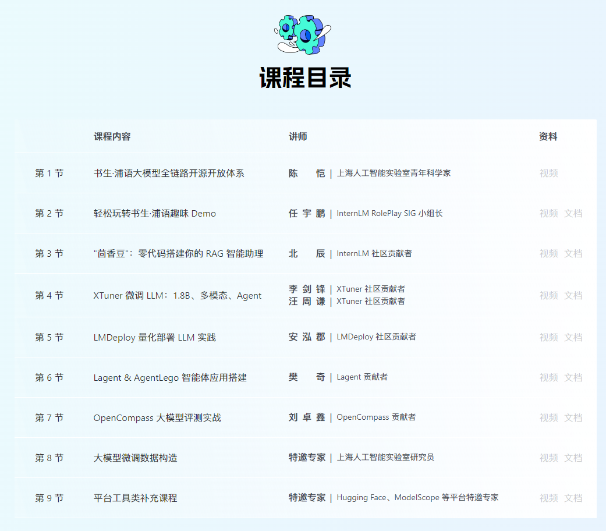

# 书生·浦语 InternLM

[书生·浦语 InternLM 官网](https://internlm.intern-ai.org.cn/)

**目录**
[toc]


# 书生·浦语 大模型实战营



[InternStudio 算力平台](https://studio.intern-ai.org.cn)

[书生·浦语 大模型实战营(第二期)](https://github.com/InternLM/Tutorial/tree/camp2)

[书生·浦语 大模型实战营(第一期)](https://github.com/internLM/tutorial)

[书生·浦语 系列模型仓库](https://github.com/internLM/internLM/)

[InterLM 典型LLM应用的模型架构和技术路线](https://wvet00aj34c.feishu.cn/wiki/FwqiwNJCSiEmXGkRzddcLYF8nAe)

[HelloWorld - 提前尝试](https://github.com/InternLM/Tutorial/blob/main/helloworld/hello_world.md)

[历史 Homework](https://github.com/chg0901/InternLM-LLM/tree/main/note/InternLM/homework)

[XTuner 大模型单卡低成本微调实战](https://github.com/InternLM/tutorial/blob/main/xtuner/README.md)

[学员手册](https://aicarrier.feishu.cn/wiki/Vv4swUFMni5DiMkcasUczUp9nid)

[项目登记表](https://aicarrier.feishu.cn/wiki/DoKWwqslwiyjjKkHhqJcvXAZnwd?table=tblyxy5MZV7gJ7yS&view=vew0rj0WuN)

[常见问题 QA](https://aicarrier.feishu.cn/wiki/AkCDwTWJtiebUkkChV0ct9uAnGc)

这次得课程基础会以1.8B模型为主，在/share/new_models里，完整路径为/root/share/new_models/Shanghai_AI_Laboratory/internlm2-chat-1_8b


## [SSH 连接开发机](https://aicarrier.feishu.cn/wiki/VLS7w5I22iQWmTk0ExpczIKcnpf)

停止开发机会重置 /root 外所有文件至开发机初始状态，请确保你的所有数据都存储在 /root 目录下
欢迎使用 InternStudio 开发机

|  目录  |   名称   |                             简介                        |
|  ---  |   --    | ------------------------------------------------------- |
|   /   |  系统目录 | 每次停止开发机会将其恢复至系统（镜像）初始状态。不建议存储数据。  |
| /root | 用户根目录| **您的所有开发机共享此目录，不受开发机的启停影响。强烈建议将 conda 环境、代码仓库等所有数据存储在此目录下。** 【注意】该目录有存储限额，超过限额后新写入的数据会被静默删除！  |
| /share |  共享目录 | 常用微调数据集、模型仓库、教程、xtuner 配置文件都存放在此。    |

Tips:
1. 快速从本地上传文件:
   ```bash
   scp -o StrictHostKeyChecking=no -r -P {端口} {本地目录} root@ssh.intern-ai.org.cn:{开发机目录}
   *注：在开发机 SSH 连接功能查看端口号 
   ```

2. 避免因终端关闭或 SSH 连接断开导致任务终止, 强烈建议使用 tmux 将实验进程与终端窗口分离： https://www.ruanyifeng.com/blog/2019/10/tmux.html
3. 查看 GPU 显存和算力使用率: vgpu-smi
4. 使用InternStudio开箱即用的conda环境:
   studio-conda {用户自定义conda名称}
5. 将conda环境一键添加到jupyterlab:
   lab add {YOUR_CONDA_ENV_NAME}

```bash
ssh-keygen -t rsa  # 用于生成 RSA 密钥对的命令

# 生成 RSA 密钥对后，你可以将公钥分发给你想要连接的远程服务器或其他计算机。
# 1. 私钥（Private Key）： 存储在用户的本地计算机上，用于对数据进行加密和签名。私钥是用户身份的一部分，必须严格保密，不得泄露。
# 2. 公钥（Public Key）： 私钥的对应文件，用于对数据进行解密和验证签名。公钥可以在网络上共享，供其他人使用来验证你的身份。

# 当尝试通过 SSH 连接到远程服务器时，服务器将会要求你提供与公钥对应的私钥来进行身份验证。
# 如果私钥正确匹配，则允许连接。
# 使用 SSH 密钥对进行身份验证比使用密码更安全，更方便，因为你无需每次连接都输入密码，而是通过私钥进行自动化身份验证。


cat /home/[username]/.ssh/id_rsa.pub  # 查看公钥(公钥位置会在上面命令结果中显示)
# ssh-rsa AAAAB3NzaC1yc2EAAAADAQABAAABgQCOfmXKujRVBf2pTilwWfDE4iOv5JApsfWIVpVHvXQnuuRY4qxg+54FAhd4ssnXMUwmwkYa7kNo2FfZ7A/v5F3e2Hy4CpZ6DyBrgYEuIH3GLbMJ6FBfFOZP2gton5wH/pLIeVRZvPZNPeqPkFJ3IKpBF9MCBDAsNA2R/n6KO2r/OWzKGZ9idOhc8xnZ1vYmckBtaMPlRGkeyVFh920GnKsWFTcO0buAz9irCzvpsjLez6t0Q4gsIHSICJwQo5RWTjz2+4GftlreF5RXi7OTxHThKOfrpkg3WyZvHn0jFCBKZvAM+/rikPXmo9oZdwXi/svVLWXw3/z/smIaZsFfvuoCWa95coNcdFsppj+f4QW8oh6OFyVhhWxQwyNLgmzoht+NfOxJYDo87EPEtJSsx+wRyHHjK59n7rYZ12wOrECpjE5eUK4e64fQIVsYmG3AcD0BU+OK0NZzWdatoTIQ+yO7IBX9LP32tXWufVZoAQJSeb4Co29ErAkRfGEktxA3vNU= lzy@legion
```

将公钥填入算力平台中的 “配置 SSH Key”


## 报名信息

**InternStudio算力平台核销码** - uE13N1mlc3ea6b54e2eb489986b124a5b9b641c8

欢迎到 https://studio.intern-ai.org.cn/ 创建算力账户。

**算力平台用户ID** 40072741

**问卷星序号ID** 1017

同时，我们特别邀请您加入书生共学计划，将实战营分享给你身边有需要的小伙伴，在帮助他人的同时，还能获得丰富的算力奖励。

[书生共学](https://s-085841-internlmcamp-t2-fission.openxlab.space/dist/index.html)

输入完成问卷后获得的核销码，定制你独一无二的分享海报，将海报分享给你身边的小伙伴，邀请他们报名实战营，共享知识的力量。

遇到任何问题请添加浦语小助手微信（ID：InternLM）咨询！


