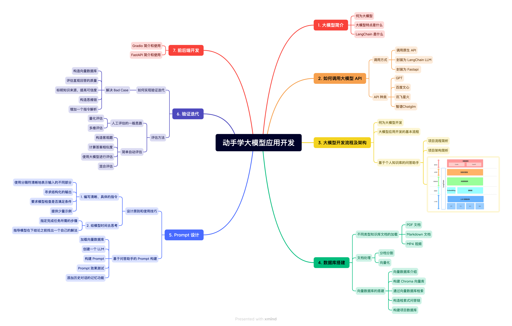
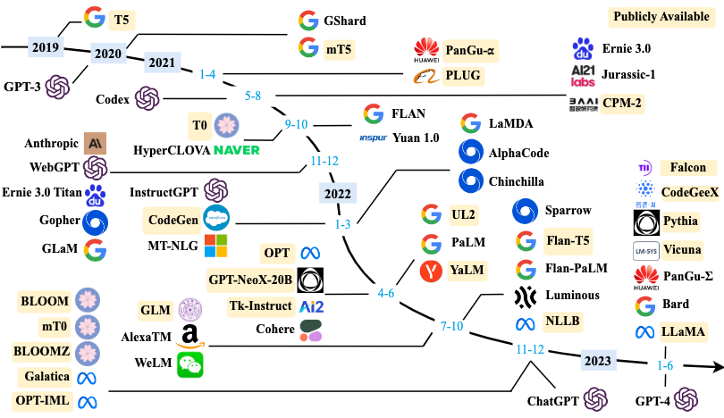
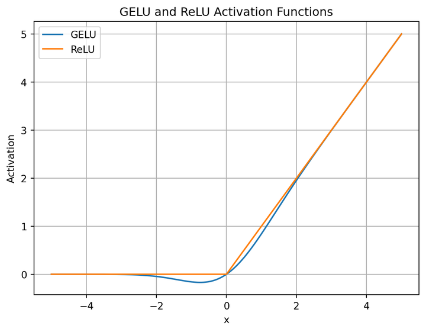

# 动手学大模型应用开发

[动手学大模型应用开发 - 在线阅读](https://datawhalechina.github.io/llm-universe/#/)

[动手学大模型应用开发 - Github](https://github.com/datawhalechina/llm-universe)



--------------------------------

## 目录
[toc]

------------------------------------------------


## 第零章 前期准备

```text
openai==0.27.6
zhipuai==1.0.7
websocket-client==1.5.2
langchain==0.0.292
pydantic==1.10.10
fastapi==0.85.1
gradio==3.40.1
python-dotenv==1.0.0
chromadb==0.3.29
pymupdf==1.23.6
markdown==3.4.3
unstructured==0.9.0
scikit-learn==1.2.2

```

```bash
pip3 install -r requirements.txt 
```

### 国内大模型API申请

[国内大模型API申请教程](https://datawhalechina.github.io/llm-universe/#/C0/1.API%E7%94%B3%E8%AF%B7%E6%95%99%E7%A8%8B)

------------------------------------------------


## 第一章 大模型简介

2018年左右，研究人员引入了 **Transformer** 架构的神经网络模型，通过大量文本数据训练这些模型，使它们能够通过阅读大量文本来深入理解语言规则和模式

随着语言模型规模的扩大（增加模型大小或使用更多数据），模型展现出了一些惊人的能力，通常在各种任务中表现显著提升

通常，大语言模型 (LLM) 指包含数百亿（或更多）参数的语言模型

为了探索性能的极限，许多研究人员开始训练越来越庞大的语言模型 ，例如拥有 1750 亿参数的 GPT-3 和 5400 亿参数的 PaLM 。

尽管这些大型语言模型与小型语言模型（例如 BERT 的 3.3 亿参数和 GPT-2 的 15 亿参数）使用相似的架构和预训练任务，但它们展现出截然不同的能力，尤其在解决复杂任务时表现出了惊人的潜力，这被称为 **涌现能力**

------------------------------------------------


**应用**
1. 自然语言处理 - 帮助计算机更好地理解和生成文本，包括写文章、回答问题、翻译语言
2. 信息检索 - 改进搜索引擎
3. 计算机视觉 - 计算机理解图像和文字

LLM 被认为是 AGI 的一种早期形式

**涌现能力 emergent abilities**
1. 区分大语言模型（LLM）与以前的预训练语言模型（PLM）最显著的特征之一是它们的涌现能力
2. 涌现能力的显现就像是模型性能随着规模增大而迅速提升，量变引起了质变
3. 涌现能力可以定义为与某些复杂任务相关的能力，3个典型的LLM涌现能力
   1. 上下文学习
   2. 指令遵循
   3. 逐步推理

**基座模型 foundation model**
1. 清晰地描述了之前学界所称的预训练模型的作用
2. 借助于海量无标注数据的训练，获得可以适用于大量下游任务的大模型（单模态或者多模态）

------------------------------------------------

**大模型的特点**
1. 巨大的规模 - 可以达到数十亿甚至数千亿个参数
2. 预训练和微调 - LLM采用了 **预训练** 和 **微调** 的学习方法。它们首先在大规模文本数据上进行 **预训练（无标签数据）**，学会了通用的语言表示和知识，然后通过 **微调（有标签数据）**适应特定任务，从而在各种NLP任务中表现出色
3. 上下文感知 - LLM在处理文本时具有强大的上下文感知能力，能够理解和生成依赖于前文的文本内容。这使得它们在 对话、文章生成和情境理解 方面表现出色
4. 多语言支持 - LLM可以用于多种语言，不仅限于英语
5. 多模态支持 - 一些LLM已经扩展到支持多模态数据，包括文本、图像和语音
6. 涌现能力 - 在大规模模型中出现但在小型模型中不明显的性能提升。它们能够处理更复杂的任务和问题
7. 多领域应用 - LLM已经被广泛应用于文本生成、自动翻译、信息检索、摘要生成、聊天机器人、虚拟助手等多个领域
8. 伦理和风险问题

------------------------------------------------


**常见大模型**

1. 闭源 LLM (未公开源代码)
   1. GPT系列
      1. OpenAI 公司在 2018 年提出的 GPT(Generative Pre-Training) 模型是典型的 生成式预训练语言模型 之一
      2. 通过语言建模将世界知识压缩到 **仅解码器** 的 Transformer 模型中，恢复(或记忆)世界知识的语义，并充当通用任务求解器
      3. ChatCPT - 会话应用 - 
      4. GPT-4 - 将文本输入扩展到多模态信号 - GPT3.5 拥有 1750亿 个参数，GPT-4 的具体参数数量尚未公开详细披露
   2. Claude系列
      1. 由 OpenAI 离职人员创建的 Anthropic 公司开发的闭源语言大模型
      2. 包含 Claude 和 Claude-Instant 两种模型可供选择
         1. Claude Instant 的延迟更低，性能略差
         2. Claude-2 的训练参数官方并未公开
      3. Claude 通常用于将长而复杂的自然语言文档转换为结构化数据格式(JSON、XML、YAML、Markdown)
      4. 训练数据仍然主要是英语
   3. PaLM 系列
      1. 由 Google 开发
      2. Google 还开发了多种 PaLM 的改进版本
         1. Med-PaLM 是 PaLM 540B 在医疗数据上进行了微调后的版本
         2. PaLM-E 是 PaLM 的多模态版本
      3. Google 基于 PaLM 2 开发的对话应用 Bard
   4. 文心一言
      1. 文心一言是基于百度文心大模型的知识增强语言大模型
      2. NLP 大模型主要为 ERNIE 系列模型，是打造文心一言的关键，文心大模型参数量非常大，达到了 2600 亿
      3. 提供 APP、网页版、API 接口等多种形式的开放服务
      4. 有监督精调、人类反馈的强化学习、提示等技术，还具备知识增强、检索增强和对话增强等
   5. 星火大模型
      1. 讯飞星火认知大模型
      2. 多模态能力，已实现图像描述、图像理解、图像推理、识图创作、文图生成、虚拟人合成
2. 开源 LLM
   1. LLaMA 系列
      1. LLaMA 系列模型是 Meta 开源的一组参数规模 从 7B 到 70B 的基础语言模型
      2. 仅使用公开可用的数据集来训练最先进的模型，而不需要依赖专有或不可访问的数据集
      3. 数据集包括 Common Crawl、Wikipedia、OpenWebText2、RealNews、Books 等
      4. LLaMA 模型使用了大规模的数据过滤和清洗技术
      5. LLaMA 模型还使用了高效的数据并行和流水线并行技术，以加速模型的训练和扩展
      6. LLaMA 模型也采用了 **decoder-only** 架构
      7. 改进
         1. Pre-normalization - 对每个 Transformer子层的输入进行了 RMSNorm 归一化，这种归一化方法可以避免梯度爆炸和消失的问题，提高模型的收敛速度和性能
         2. SwiGLU 激活函数 - 将 ReLU 非线性替换为 SwiGLU 激活函数，增加网络的表达能力和非线性，同时减少参数量和计算量
         
         3. RoPE 位置编码 - 模型的输入不再使用位置编码，而是在网络的每一层添加了位置编码，RoPE 位置编码可以有效地捕捉输入序列中的相对位置信息
   2. GLM 系列
      1. GLM 系列模型是清华大学和智谱 AI 等合作研发的开源语言大模型
      2. ChatGLM 是基于 GLM 结构开发的具有 62 亿参数量的语言大模型，支持 2048 的上下文长度
      3. 通过 FlashAttention 技术，ChatGLM 2 能够处理更长的长下文，支持的长下文长度达到了 3.2 万字符。
      4. 通过 Multi-Query Attention 技术，ChatGLM 2 能够进一步地提升推理速度，减小对显卡的显存占用。
      5. 对标
         1. 在对话模型上，对标 ChatGPT 的是 ChatGLM
         2. 在文生图方面，对标 DALL.E 的是 CogView
         3. 代码生成上，与 Codex 相对的是 CodeGeeX
         4. 搜索增强上，与 WebGPT 相对的是 WebGLM
         5. 在多模态、图文理解领域，与 GPT-4V 对标的有 ChatGLM3
   3. 通义千问
      1. 通义千问由阿里巴巴基于“通义”大模型研发
      2. 阿里云开源了Qwen（通义千问）系列工作，当前开源模型的参数规模为70亿（7B）和140亿（14B）
      3. 基础模型Qwen，即 Qwen-7B 和 Qwen-14B ，以及对话模型 Qwen-Chat ，即 Qwen-7B-Chat 和 Qwen-14B-Chat。
   4. Baichuan 系列
      1. Baichuan 是由百川智能开发的开源可商用的语言大模型，在权威的中文和英文 benchmark 上均取得同尺寸最好的效果，其基于Transformer 解码器架构
      2. 尺寸
         1. Baichuan-7B - 70 亿参数模型，支持中英双语，最大 4096 的上下文窗口长度
         2. Baichuan-13B - 扩大参数量到 130 亿，使用 ALiBi 位置编码，最大 4096 的上下文窗口长度，使用 rotary-embedding
         3. 百川同时开源了预训练和对齐模型，预训练模型是面向开发者的“基座”，而对齐模型则面向广大需要对话功能的普通用户
         4. 为实现更高效的推理，百川开源了 INT8 和 INT4 的量化版本


------------------------------------------------

**LangChain**

尽管大型语言模型的调用相对简单，但要创建完整的应用程序，仍然需要大量的定制开发工作，包括API集成、互动逻辑、数据存储等等。

LangChain 框架是一个开源工具，充分利用了大型语言模型的强大能力，以便开发各种下游应用。它的目标是为各种大型语言模型应用提供通用接口，从而简化应用程序的开发流程。

帮助开发者们快速构建基于大型语言模型的端到端应用程序或工作流程


**Langchain 核心组件**

将 LLM 模型（对话模型、embedding模型等）、向量数据库、交互层 Prompt、外部知识、外部代理工具整合到一起，进而可以自由构建 LLM 应用

**核心模块**
1. **模型输入/输出**（Model I/O）：与语言模型交互的接口。
2. **数据连接**（Data connection）：与特定应用程序的数据进行交互的接口。
3. **链**（Chains）：将组件组合实现端到端应用。
4. **记忆**（Memory）：用于链的多次运行之间持久化应用程序状态。
5. **代理**（Agents）：扩展模型的推理能力，用于复杂的应用的调用序列。
6. **回调**（Callbacks）：扩展模型的推理能力，用于复杂的应用的调用序列。


------------------------------------------------


## 第二章 调用大模型 API

------------------------------------------------


## 第三章 大模型开发流程及架构

------------------------------------------------


## 第四章 数据库搭建

------------------------------------------------


## 第五章 Prompt设计

------------------------------------------------


## 第六章 验证迭代

------------------------------------------------


## 第七章 前后端搭建

------------------------------------------------


## 第八章 总结与拓展


