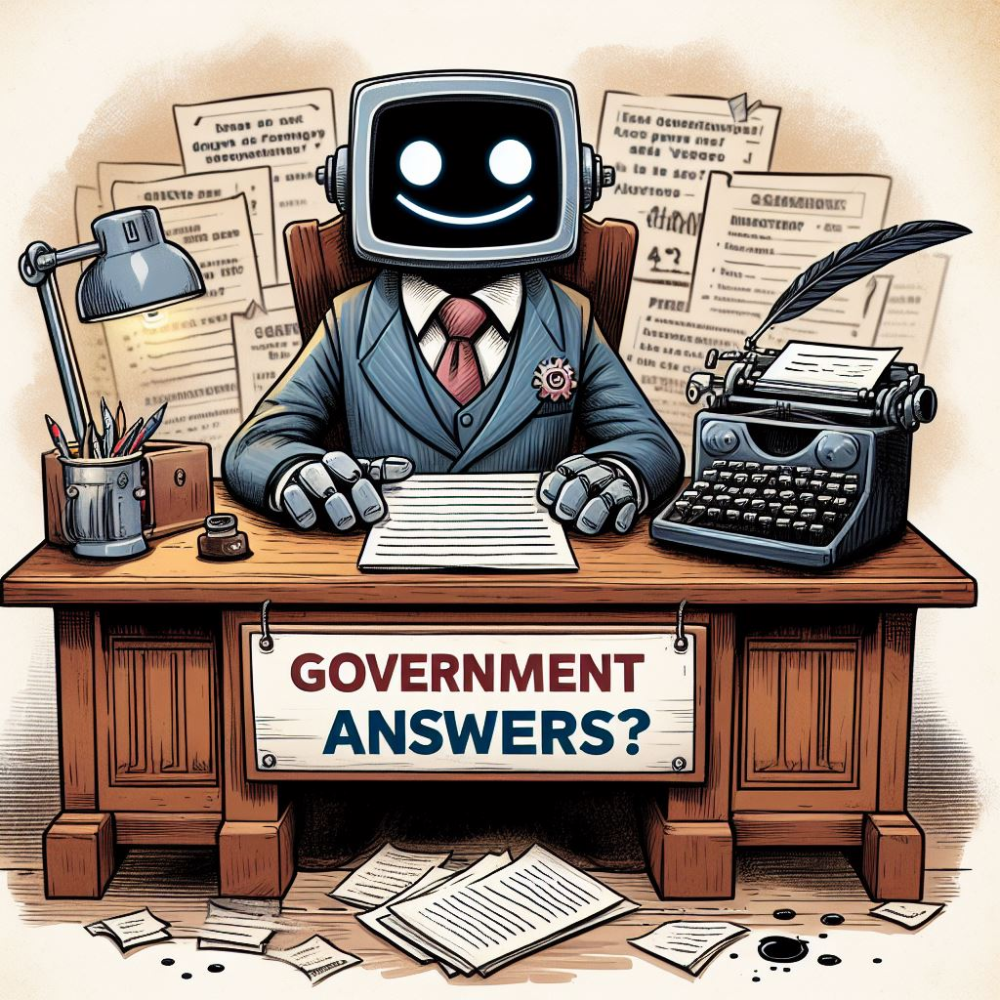

# GovChatBot

A large language model aims to help people learn the latest news and policies. The datasets are automatically collect from open article and policies from the government. What's more, the model can collect the chat and analyse the key-point which citizens concern most. The model will be trained with RAG and SFT.

