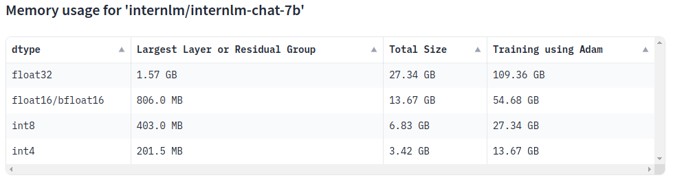
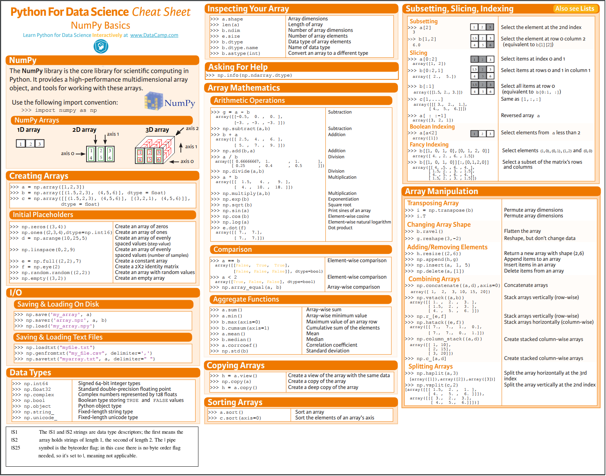

# GovChatBot

A large language model aims to help people learn the latest news and policies. The datasets are automatically collect from open article and policies from the government. What's more, the model can collect the chat and analyse the key-point which citizens concern most. The model will be trained with RAG and SFT.

---

**目录**
[TOC]

---

## 相关资料

### 动手学大模型应用开发

### 🤗 HugginFace

[HuggingFace](https://huggingface.co/)

[Model Memory Calculator - 显存计算工具](https://huggingface.co/spaces/hf-accelerate/model-memory-usage)

[internlm/internlm-chat-7b](https://huggingface.co/internlm/internlm-chat-7b)

名称解释
1. dtype - 数据类型
2. Largest Layer or Residual Group - 模型中最大的层所需的显存(如果超过单卡最大显存，则无论使用多少GPU都无法运行)
3. Total Size - 模型推理使用的总显存
4. Training using Adam - 模型使用Adam优化器训练时所需显存(一般是推理的4倍)

### 政务解决方案

[百度智能云九州数字政府解决方案](https://cloud.baidu.com/solution/jiuzhoucitybrain.html)

[Baidu - 一网通办解决方案](https://cloud.baidu.com/solution/city/governmentaffairs.html)

[Baidu - 一网统管解决方案](https://cloud.baidu.com/solution/city/one-network.html)

### Numpy Cheatsheet

---

Made with [contrib.rocks](https://contrib.rocks).

